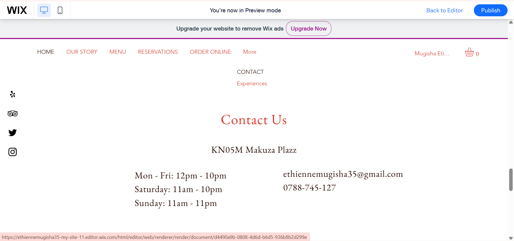
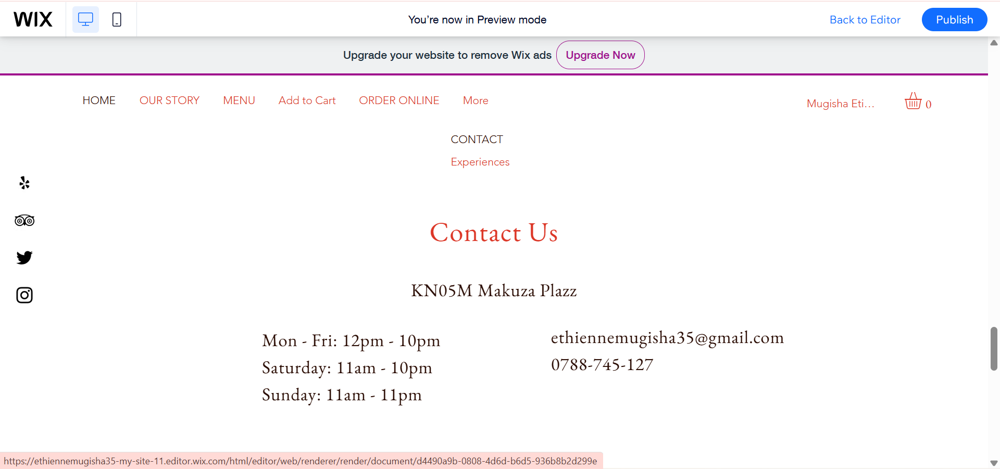
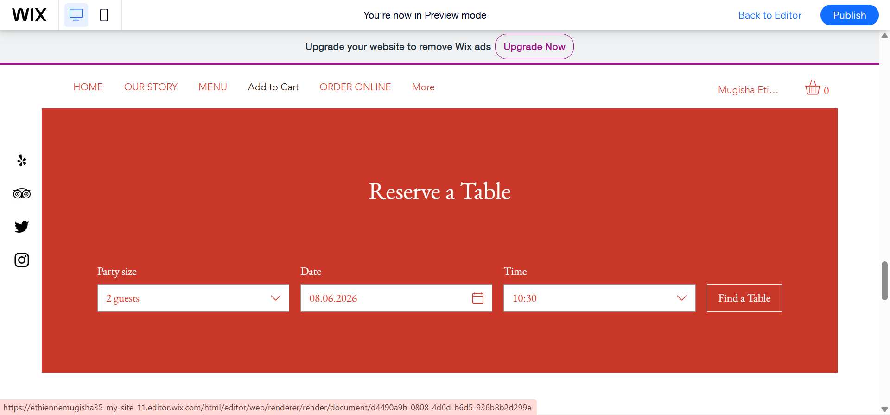
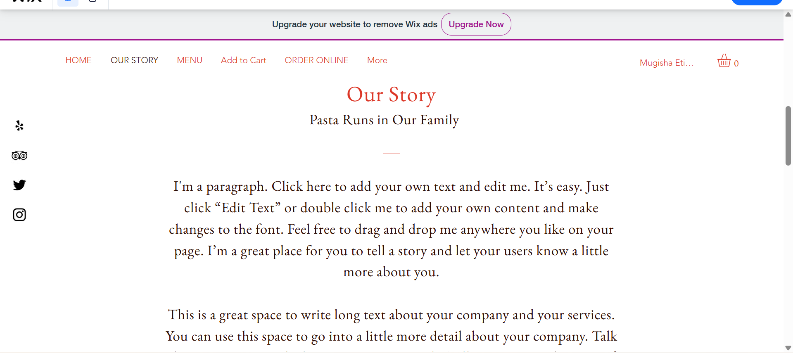
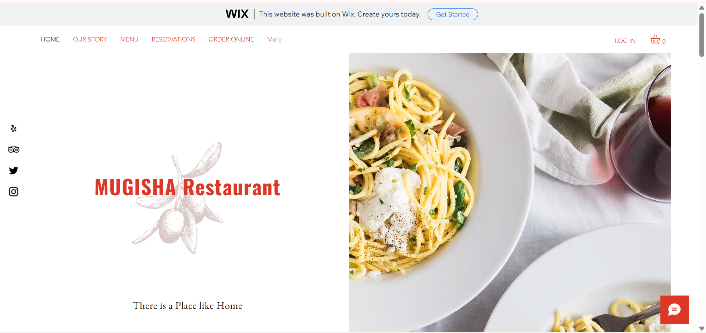

# MUGISHA Restaurant - No-Code E-Commerce Website

## Student Information

| Item          | Details                                    |
| ------------- | ------------------------------------------ |
| Student Name  | Mugisha Ethienne                           |
| Student ID    | 24174/2024                                 |
| Course        | E-Commerce And Web Application (EWA408510) |
| Institution   | UNILAK                                     |
| Academic Year | 2025-2026                                  |
| Lecturer      | Eric Maniraguha                            |
| Project Type  | No-Code E-Commerce Website                 |
| Platform Used | Wix                                        |

---

# Project Title

**MUGISHA Restaurant – Italian Restaurant E-Commerce Website**

---

# Project Overview

Welcome to **MUGISHA Restaurant**, a premier Italian dining destination located in Kigali, Rwanda.

This website was developed using **Wix**, a No-Code website development platform, to provide customers with a modern and convenient online restaurant experience.

Customers can browse menu items, view product details and prices, learn about the restaurant, contact the business, and interact with the shopping cart system.

The website is designed with a responsive layout, attractive user interface, and simple navigation to enhance customer satisfaction.

---

# Platform Used

## Wix Website Builder

This project was developed using Wix because it offers:

* Easy drag-and-drop website design
* Professional website templates
* Mobile responsive layouts
* Integrated e-commerce functionality
* Secure hosting and deployment
* User-friendly content management
* Fast website publishing

---

# Features Implemented

## Homepage

The Homepage contains:

* Restaurant logo
* Restaurant name
* Welcome message
* Navigation menu
* Featured food items
* Call-to-action buttons
* Professional visual design

### Welcome Message

> Welcome to MUGISHA Restaurant, where authentic Italian flavors meet exceptional hospitality. Experience delicious meals prepared with passion and served in a warm and elegant atmosphere.

---

## Product/Menu Page

The Product/Menu Page includes:

* Product images
* Product names
* Product prices
* Product descriptions
* Add-to-cart functionality

### Available Menu Items

1. Handcrafted Italian Pasta
2. Wood-Fired Pizza
3. Risotto
4. Fresh Salads
5. Italian Desserts
6. Coffee & Beverages
7. Special Family Meals

---

## About Page

### About Us

At MUGISHA Restaurant, we take pride in preparing every dish using fresh, high-quality ingredients and traditional Italian cooking techniques.

Our menu features a variety of Italian specialties, including handcrafted pasta, wood-fired pizzas, creamy risottos, fresh salads, and delightful desserts.

Our mission is to provide an unforgettable dining experience that combines authentic Italian cuisine with the renowned hospitality of Rwanda.

---

## Our Mission

To provide customers with authentic Italian cuisine, exceptional service, and memorable dining experiences in a welcoming environment.

---

## Our Vision

To become the leading Italian restaurant in Rwanda by delivering exceptional food, outstanding service, and memorable dining experiences.

---

## Why Choose Us?

* Authentic Italian Recipes
* Fresh and Quality Ingredients
* Professional Chefs
* Friendly Customer Service
* Comfortable Dining Environment
* Elegant Restaurant Design
* Online Ordering System
* Reservation Services

---

## Contact Page

The Contact Page includes:

* Contact form
* Email address
* Phone number
* Restaurant location

### Contact Information

**Restaurant Name:** MUGISHA Restaurant

**Phone:** +250 788 745 127

**Email:** [ethiennemugisha35@gmail.com](mailto:ethiennemugisha35@gmail.com)

**Location:** Kigali, Rwanda

---
# Screenshots

## Homepage

1.png

---

## Product/Menu Page

[](images/2.png)

---

## Shopping Cart Page

[](images/3.png)

---

## Contact Page

[](images/4.png)

---

## About Us Page

[](images/AboutUs5.png)

## Shopping Cart Functionality

The website includes a shopping cart system that allows customers to:

* Add menu items to cart
* View selected items
* Update quantities
* Remove products from cart
* Simulate checkout process

---

# Website Pages

The website contains the following pages:

* Home Page
* Product/Menu Page
* About Us Page
* Contact Page
* Shopping Cart Page

---

# Screenshots

## Homepage

[](images/1.png)

---

## Product/Menu Page

[](images/2.png)

---

## Shopping Cart Page

[](images/3.png)

---

## Contact Page

[](images/4.png)

---

## About Us Page

[](images/AboutUs5.png)

---

# Challenges Encountered

During the development of this project, the following challenges were encountered:

* Designing a professional restaurant website layout
* Organizing products and menu information
* Customizing Wix templates
* Managing website content and images
* Creating responsive navigation menus
* Implementing shopping cart functionality
* Ensuring mobile responsiveness

---

# Lessons Learned

Through this project, I learned:

* No-Code website development using Wix
* E-commerce website design principles
* User Interface (UI) design
* User Experience (UX) optimization
* Website content management
* GitHub repository management
* Markdown documentation
* Online business presentation

---

# Live Website Link

🔗 **Visit MUGISHA Restaurant Website**

https://ethiennemugisha35.wixsite.com/my-site-11

---

# GitHub Repository Link

🔗 **View Project Repository**

https://github.com/Mugisha20000/https-ethiennemugisha35.wixsite.com-my-site-11

---

# Repository Structure

```text
mugisha-restaurant/
│
├── README.md
│
└── images/
    ├── 1.png
    ├── 2.png
    ├── 3.png
    ├── 4.png
    └── AboutUs5.png
```

---

# Project Objectives Achieved

✅ Homepage created

✅ Product/Menu page created

✅ About page created

✅ Contact page created

✅ Shopping cart functionality implemented

✅ Product images added

✅ Responsive design achieved

✅ GitHub repository created

✅ Markdown documentation completed

✅ Screenshots included

---

# Conclusion

The MUGISHA Restaurant project successfully demonstrates the use of a No-Code platform to build a professional restaurant e-commerce website.

The website provides customers with an engaging platform to explore menu items, learn about the restaurant, contact the business, and interact with the shopping cart system.

This project strengthened my skills in website design, e-commerce development, GitHub documentation, and digital business presentation.

---

## Copyright

© 2026 MUGISHA Restaurant. All Rights Reserved.
